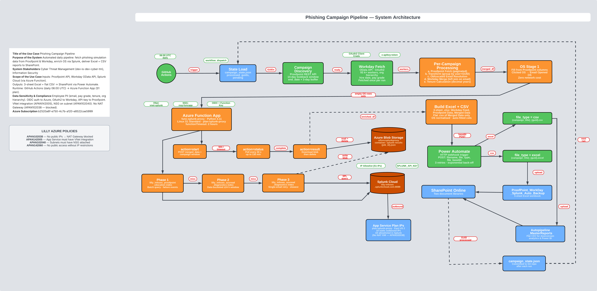

# Automated Pipeline for Educational Phishing Campaign Reports

Automated daily pipeline that fetches, enriches, and uploads phishing simulation campaign reports for Education Phishing (Eli Lilly Information Security). Integrates Proofpoint Security Awareness, Workday, Splunk Cloud (via Azure Function App proxy), and SharePoint.

---

## Overview



Every day, GitHub Actions runs `campaign_merge.py` which:

1. Discovers new phishing campaigns from the Proofpoint API
2. Fetches all campaign participant records (every user sent, opened, clicked, reported)
3. Enriches each record with Workday employee data (org hierarchy, tenure, pay grade)
4. Resolves OS data from Proofpoint columns and — for failed/reported users where that is absent — from Splunk via an Azure Function App proxy
5. Builds a 3-sheet Excel workbook and a flat CSV per campaign
6. Uploads both files to SharePoint via Power Automate

---

## Why an Azure Function App?

GitHub Actions runners use dynamic IP addresses that change every run. Splunk Cloud enforces an IP allowlist on port 8089 and blocks unknown IPs. Since GitHub's IPs cannot be pre-approved in Splunk, an intermediary with fixed outbound IPs is required.

The Azure Function App (`func-splunk-proxy`) runs inside a dedicated Azure VNet on a Standard S1 App Service Plan. Its outbound IPs are static and registered with Splunk. `campaign_merge.py` POSTs the merged data to the function, the function runs the Splunk queries, and returns enriched results.

### Async Pattern

Azure App Service has a hard 230-second HTTP timeout on inbound connections. Splunk enrichment for a large campaign can take 10–60 minutes. To handle this, the function uses an **async blob pattern**:

| `action` | What happens |
|---|---|
| `start` | Runs enrichment, writes result to Azure Blob Storage, returns `{"status":"complete","job_id":"..."}`. If HTTP drops after 230s, the function keeps running. |
| `status` | Checks if the result blob exists. Returns `pending` or `complete`. |
| `result` | Downloads the result blob, returns enriched rows as JSON, deletes the blob. |

The pipeline POSTs `action=start`, polls `action=status` every 30 seconds for up to 130 minutes, then fetches `action=result`.

### Batching

The Azure App Service has a 100MB request body limit. Large enterprise campaigns (70k+ rows) would exceed this and cause 502 errors. Rows requiring Splunk enrichment are split into batches of `AZURE_FUNCTION_BATCH_SIZE` rows (default: 5,000). Each batch is submitted as a separate async job and results are merged back in order.

---

## OS Enrichment — Two Stages

OS data is resolved in two stages. Only users who **failed** (clicked, submitted credentials, opened attachment) or **reported** the phishing email are enriched — sent/opened-only users are excluded from Splunk lookups as their OS is not relevant to the report.

**Stage 1 — Proofpoint columns (instant, no API calls)**
- For every row, check if Proofpoint already returned OS data in `Clicked OS` or `Email Opened OS`
- If found, populate `splunk_os` directly from those columns
- `splunk_ts_source` is set to `proofpoint_column(clicked_os)` or `proofpoint_column(email_opened_os)`

**Stage 2 — Azure Function / Splunk (failed/reported users only, where Stage 1 found nothing)**
- Only rows where `Primary Clicked`, `Primary Compromised Login`, `Primary Attachment Open`, or `Reported` is TRUE — AND `splunk_os` is still empty — are sent to the function
- Sent/opened-only users are skipped entirely, keeping Splunk query volume low
- Phase 1: Proofpoint Splunk index (`lilly_infosec_proofpoint_education`) — failure events
- Phase 2: AzureAD batch (`lilly_infosec_azuread_diagnostics`) — sign-in logs ±24h of click
- Phase 3: Single-email AzureAD retry over the full campaign window

Splunk results never overwrite Stage 1 values.

---

## Repository Structure

```
phishing-campaign-report/
├── .github/
│   └── workflows/
│       ├── phishing_report.yml     # Daily scheduled workflow
│       ├── phishing_backfill.yml   # Manual backfill workflow (date range input)
│       └── phishing_reprocess.yml  # Manual reprocess workflow (ignores processed_guids)
├── campaign_merge.py               # Main pipeline script
├── campaign_state.json             # Persisted run state (auto-updated by workflow)
├── requirements.txt                # Python dependencies
└── README.md
```

---

## Workflows

### Daily — `phishing_report.yml`

Runs automatically every day at 06:00 UTC. Scans the last `PROOFPOINT_DISCOVERY_LOOKBACK_DAYS` days (default: 40) for new campaigns, processes any that are ready, and commits the updated `campaign_state.json` back to the repository.

Can also be triggered manually via **Actions → Phishing Campaign Report → Run workflow**.

### Backfill — `phishing_backfill.yml`

Manual trigger only. Used to process historical campaigns outside the normal lookback window. Accepts two inputs:

| Input | Required | Description |
|---|---|---|
| `start_date` | Yes | Start of scan range, e.g. `2025-01-01` |
| `end_date` | No | End of scan range. Defaults to today if blank. |

The backfill scans month-by-month between the two dates, discovers all campaigns, and processes any not already in `processed_guids`. State is saved incrementally after each successful campaign so progress is preserved if the 6-hour GitHub Actions timeout is hit.

To trigger: **Actions → Phishing Campaign Backfill → Run workflow**.

### Reprocess — `phishing_reprocess.yml`

Manual trigger only. Used to regenerate output files for campaigns that have already been processed, without modifying `campaign_state.json`. Accepts two inputs:

| Input | Required | Description |
|---|---|---|
| `start_date` | Yes | Reprocess campaigns with `startDate` on or after this date |
| `end_date` | Yes | Reprocess campaigns with `endDate` on or before this date |

All campaigns in the date range are force-run regardless of whether their GUID is in `processed_guids`. State is not updated — `processed_guids` remains unchanged after a reprocess run.

To trigger: **Actions → Phishing Campaign Reprocess → Run workflow**.

---

## campaign_state.json

Persists across runs. Tracks:
- `processed_guids` — campaigns fully processed and uploaded. Never re-processed by the daily or backfill workflows.
- `pending_campaigns` — campaigns discovered but not yet ready (end date + 3-day buffer not reached).
- `last_run_utc` — timestamp of the last run.

The workflow commits this file back to the repository after each run using `if: always()` so it saves even when a campaign fails. State is also saved **incrementally** after each individual campaign succeeds, so a mid-run 6-hour timeout does not lose progress.

A campaign is considered **ready** when today ≥ campaign end date + `END_DATE_OFFSET_DAYS` (default: 3 days).

To force re-processing of a specific campaign without triggering the reprocess workflow, remove its GUID from `processed_guids` and re-run.

---

## Output Files

Two files are produced per campaign and uploaded to SharePoint:

| File | Destination Folder | Contents |
|---|---|---|
| `{title}_{guid}.xlsx` | `ProofPoint_WorkDay_Splunk_Auto_Backup` | 3 sheets: Workday Feed, Proofpoint Data, Merged Data |
| `{title}_{guid}.csv` | `Autopipeline_MasterReports` | Flat export of Merged Data |

Files are POSTed as base64-encoded JSON payloads to a Power Automate HTTP trigger webhook which handles the SharePoint write.

---

## Required Secrets

Set these in **Settings → Secrets and variables → Actions**:

| Secret | Description |
|---|---|
| `AZURE_FUNCTION_URL` | Full Function App URL including `?code=` key |
| `PROOFPOINT_BASE_URL` | Proofpoint Security Awareness API base URL |
| `PROOFPOINT_API_KEY` | Proofpoint Security Awareness API key |
| `WORKDAY_CLIENT_ID` | Workday OAuth2 client ID |
| `WORKDAY_CLIENT_SECRET` | Workday OAuth2 client secret |
| `WORKDAY_TOKEN_URL` | Workday OAuth2 token endpoint |
| `WORKDAY_API_URL` | Workday Workers OData API base URL |
| `WORKDAY_SCOPE` | Workday OAuth2 scope |
| `POWER_AUTOMATE_WEBHOOK_URL` | Power Automate HTTP trigger URL |
| `POWER_AUTOMATE_WEBHOOK_AUTH` | Power Automate webhook auth header (if required) |

---

## Environment Variables (Optional Overrides)

| Variable | Default | Description |
|---|---|---|
| `PROOFPOINT_DISCOVERY_LOOKBACK_DAYS` | `20` | Days back to scan for new campaigns (daily workflow) |
| `END_DATE_OFFSET_DAYS` | `3` | Days after campaign end date before processing |
| `START_DATE_OFFSET_DAYS` | `-2` | Days before campaign start for Proofpoint fetch window |
| `AZURE_FUNCTION_BATCH_SIZE` | `5000` | Max rows per Azure Function job |
| `BACKFILL_FROM` | — | Set by backfill workflow. Triggers month-by-month scan from this date. |
| `BACKFILL_TO` | — | Set by backfill workflow. Caps scan end date. Defaults to today if blank. |
| `REPROCESS_FROM` | — | Set by reprocess workflow. Force-runs campaigns from this date. |
| `REPROCESS_TO` | — | Set by reprocess workflow. Force-runs campaigns up to this date. |
| `LOG_LEVEL` | `INFO` | Logging verbosity (`DEBUG`, `INFO`, `WARNING`) |

---

## Azure Function App

| Property | Value |
|---|---|
| Name | `func-splunk-proxy` |
| Resource Group | `rg-splunk-proxy` |
| Subscription | `dev-is-dev-cyber-tm` |
| Runtime | Python 3.11 |
| Plan | Standard S1 (Linux) — required for VNet integration and 2-hour `functionTimeout` |
| VNet | `vnet-splunk` / subnet `snet-funcapp` (10.0.1.0/24) |
| Storage | `stfuncsplunkproxy` — result blobs in container `splunk-results` |
| `functionTimeout` | 2 hours (`00:02:00:00` in `host.json`) |

### Deploying the Function App

```powershell
cd C:\Users\L123065\splunk-proxy
func azure functionapp publish func-splunk-proxy --python --force
```

> The function key does not change on republish. `AZURE_FUNCTION_URL` remains valid across all deployments.

---

## Failure & Retry Behaviour

If a campaign fails for any reason (Splunk timeout, 502 from the function, upload failure) it remains in `pending_campaigns` and is automatically retried on the next daily run. A campaign is only marked as permanently processed after a successful SharePoint upload.

The workflow exits with code `1` if any campaign fails, marking the GitHub Actions run as failed for visibility. The state commit step runs regardless (`if: always()`), so progress is always saved.

---

## Dependencies

```
requests
pandas
openpyxl
python-dotenv
urllib3
```

The Function App additionally requires `azure-functions` and `azure-storage-blob`.